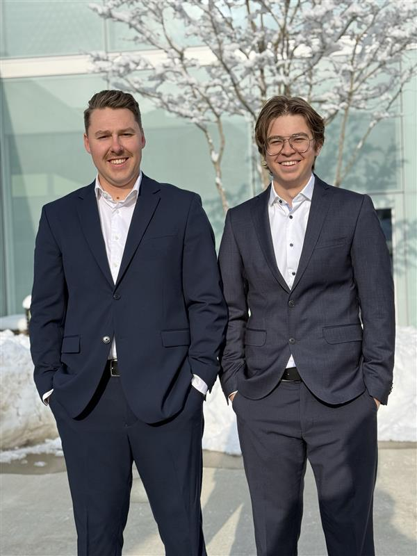
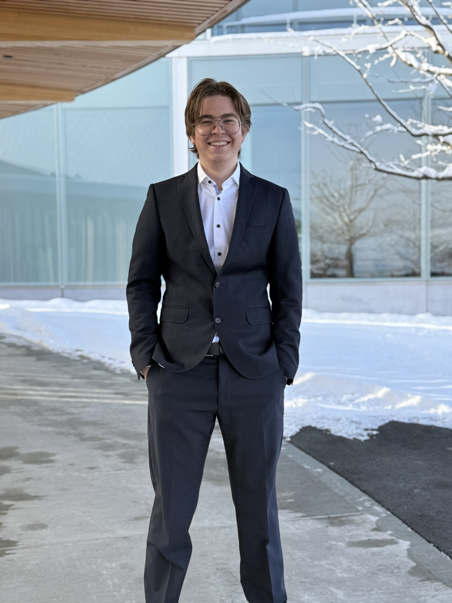

# Change You Can See, Value You Can Feel

## What We Stand For – An SHSG That Truly Makes a Difference

We believe in an SHSG that is transparent, responsive, and committed to real change. Student concerns should be heard, decisions should be open, and campus life should be improved with tangible actions.

Our goal is to go beyond promises and deliver meaningful improvements—from better study spaces to a more vibrant campus culture.

<!-- Insert your images below. -->

## Our Concrete Plans – More Than Just Promises

### 1. More Study Spaces – Because Learning Shouldn’t Be a Competition

With 10,000 students but only 5,000 study spaces, finding a place to study is a daily struggle.

We will:
- ✅ Expand study space capacity by optimizing existing areas and creating new ones.
- ✅ Collaborate with the university to repurpose underused spaces.

### 2. More Microwaves on Campus – Expanding Convenience for Students

Current microwaves don’t meet demand, leading to long wait times.

We will:
- ✅ Add microwaves at key locations, especially at Mensa A.
- ✅ Ensure better distribution across campus for easier access.

### 3. A Bigger Adhoc – More Space for Student Life

Adhoc is a key part of student culture, but its size limits participation.

We will:
- ✅ Expand Adhoc to accommodate more students.
- ✅ Enhance event accessibility so no one is left out.
- ✅ Strengthen campus culture with more space for engagement.

### 4. Keeping Study Spaces Open & Rethinking Campus Closures

This year, students lost access to study spaces for two weeks during exam season.

We will:
- ✅ Ensure co-working spaces remain open during study phases.
- ✅ Advocate for broader university access during critical periods.
- ✅ Discuss with the administration to prevent full campus closure over Christmas.

### 5. A More Transparent SHSG – Open Decision-Making for Students

SHSG represents all students, but too often, key decisions happen behind closed doors without enough student input.

We will:
- ✅ Push for open and accessible SHSG meetings, where students can directly engage with leadership.
- ✅ Provide clear updates on major decisions through easy-to-access summaries and Q&A sessions.
- ✅ Ensure more student participation in key decision-making processes, so everyone has a say in shaping their university experience.

### 6. A More Vibrant Campus – Strengthening Community and Traditions

University life is more than academics. We will:
- ✅ Create more interactive student spaces.
- ✅ Organize more networking & cultural events.
- ✅ Continue the Christmas event at the Square, making it an annual tradition that brings students together and fosters a stronger sense of community.

## Why This Matters

These are real changes that will directly improve student life. With your support, we can make HSG a more accessible, engaging, and student-friendly university.

**Vote for Leonardo Moser & Julian Bodenmann – because this is change you can see, and value you can feel.**
