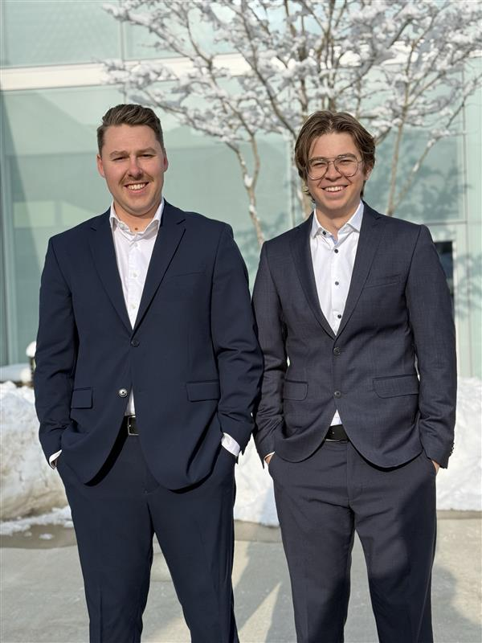

layout: default
title: "SHSG-Kampagne"
permalink: /de/index

<!-- Language Switcher Button -->

  <a href="SHSG_election25/" style="display: inline-block; padding: 10px 20px; background-color: #007bff; color: #fff; text-decoration: none; border-radius: 5px;">
    English
  </a>

<!-- Inline CSS styles -->

<h1>Wofür wir stehen – Eine SHSG, die wirklich etwas bewegt</h1>

  Wir glauben an eine SHSG, die transparent, ansprechbar und entschlossen ist, echte Veränderungen zu bewirken. Die Anliegen der Studierenden müssen gehört, Entscheidungen offengelegt und das Campusleben durch konkrete Massnahmen verbessert werden.

  Unser Ziel ist es, über leere Versprechen hinauszugehen und spürbare Verbesserungen zu liefern – von besseren Lernräumen bis hin zu einer lebendigeren Campus-Kultur.

<!-- Insert your images below -->

<h2>Unsere konkreten Pläne – Mehr als nur Versprechen</h2>

  
<strong>1. Mehr Lernplätze – Weil Lernen kein Wettbewerb sein sollte</strong>

  

    Mit 10.000 Studierenden, aber nur 5.000 Lernplätzen, ist die Suche nach einem Platz zum Lernen ein täglicher Kampf.
  

  
Wir werden:

  <ul>
    <li>✅ Die Kapazität der Lernplätze durch Optimierung bestehender Räume und die Schaffung neuer Plätze erweitern.</li>
    <li>✅ Mit der Universität zusammenarbeiten, um ungenutzte Räume besser zu nutzen.</li>
  </ul>

  
<strong>2. Mehr Mikrowellen auf dem Campus – Mehr Komfort für Studierende</strong>

  

    Die derzeitige Anzahl an Mikrowellen reicht nicht aus – lange Wartezeiten sind die Folge.
  

  
Wir werden:

  <ul>
    <li>✅ Zusätzliche Mikrowellen an wichtigen Standorten, insbesondere in der Mensa A, bereitstellen.</li>
    <li>✅ Eine bessere Verteilung auf dem Campus sicherstellen, damit alle Studierenden schnellen Zugang haben.</li>
  </ul>

  
<strong>3. Ein grösseres Adhoc – Mehr Raum für das Studierendenleben</strong>

  

    Das Adhoc ist ein zentraler Ort der studentischen Kultur, doch seine Grösse schränkt die Teilnahmemöglichkeiten stark ein.
  

  
Wir werden:

  <ul>
    <li>✅ Das Adhoc ausbauen, um mehr Studierenden Platz zu bieten.</li>
    <li>✅ Den Zugang zu Veranstaltungen verbessern, sodass niemand ausgeschlossen wird.</li>
    <li>✅ Die Campus-Kultur durch mehr Raum für Engagement und Austausch stärken.</li>
  </ul>

  
<strong>4. Geöffnete Lernräume &amp; ein Umdenken bei Campus-Schliessungen</strong>

  

    Dieses Jahr waren Lernräume während der Prüfungsphase zwei Wochen lang nicht zugänglich – ein unnötiger Nachteil für Studierende.
  

  
Wir werden:

  <ul>
    <li>✅ Sicherstellen, dass Co-Working-Spaces während der Lernphasen offen bleiben.</li>
    <li>✅ Für eine erweiterte Zugänglichkeit der Universität in kritischen Zeiten eintreten.</li>
    <li>✅ Mit der Uni-Verwaltung verhandeln, um eine vollständige Campusschliessung über Weihnachten zu verhindern.</li>
  </ul>

  
<strong>5. Eine transparentere SHSG – Offene Entscheidungen für Studierende</strong>

  

    Die SHSG vertritt alle Studierenden, doch wichtige Entscheidungen werden oft hinter verschlossenen Türen und ohne ausreichende studentische Mitbestimmung getroffen.
  

  
Wir werden:

  <ul>
    <li>✅ Für offene und zugängliche SHSG-Sitzungen sorgen, bei denen Studierende direkt mit der Leitung interagieren können.</li>
    <li>✅ Klare Updates zu wichtigen Entscheidungen durch leicht zugängliche Zusammenfassungen und Q&amp;A-Sessions bereitstellen.</li>
    <li>✅ Mehr studentische Mitbestimmung in zentralen Entscheidungsprozessen ermöglichen, damit alle ihre Universität aktiv mitgestalten können.</li>
  </ul>

  
<strong>6. Ein lebendigerer Campus – Gemeinschaft und Traditionen stärken</strong>

  

    Das Unileben besteht aus mehr als nur dem Studium.
  

  
Wir werden:

  <ul>
    <li>✅ Mehr interaktive Studierendenräume schaffen.</li>
    <li>✅ Mehr Networking- und Kulturveranstaltungen organisieren.</li>
    <li>✅ Die Weihnachtsveranstaltung am Square fortsetzen und zu einer jährlichen Tradition machen, die Studierende zusammenbringt und das Gemeinschaftsgefühl stärkt.</li>
  </ul>

<h2>Warum das wichtig ist</h2>

  Diese Massnahmen bringen echte, greifbare Verbesserungen für das Studierendenleben. Mit eurer Unterstützung können wir die HSG zu einer zugänglicheren, lebendigeren und studierendenfreundlicheren Universität machen.

  <strong>Stimmt für Leonardo Moser &amp; Julian Bodenmann – weil das Veränderung ist, die du sehen kannst, und Wert, den du spüren kannst.</strong>

<h2>Kontakt</h2>

  <a href="https://www.linkedin.com/in/leonardo-moser-835755209/" target="_blank" style="display: inline-block; padding: 10px 20px; margin-right: 20px; background-color: #007030; color: #fff; text-decoration: none; border-radius: 5px;">
    Kontaktiere Leonardo auf LinkedIn
  </a>
  <a href="https://www.linkedin.com/in/julian-bodenmann-976040299/" target="_blank" style="display: inline-block; padding: 10px 20px; background-color: #007030; color: #fff; text-decoration: none; border-radius: 5px;">
    Kontaktiere Julian auf LinkedIn
  </a>

